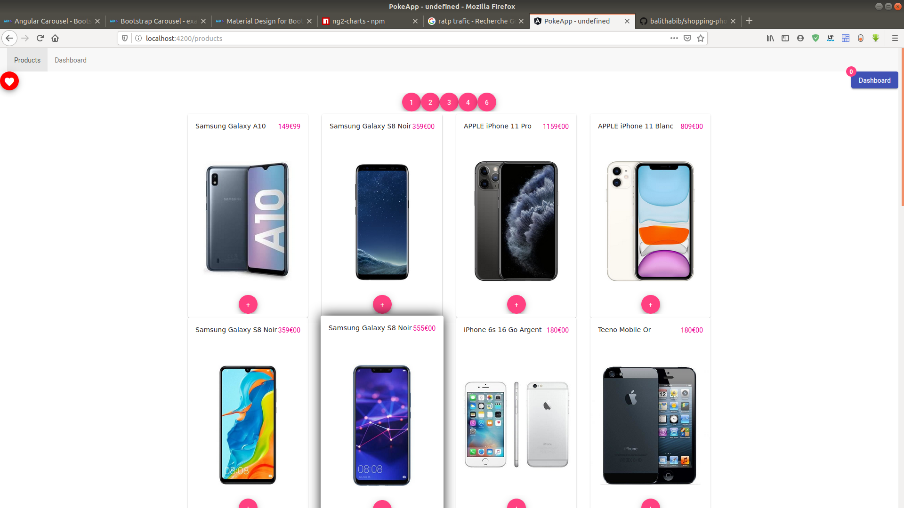
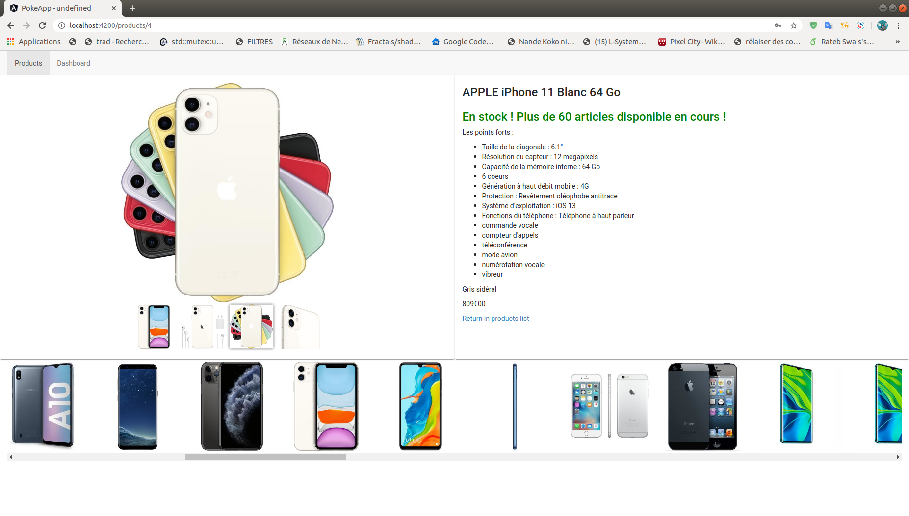
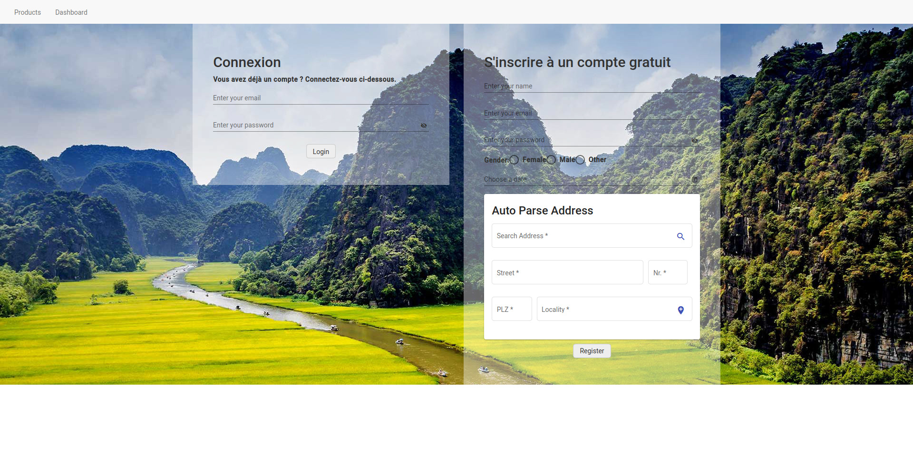
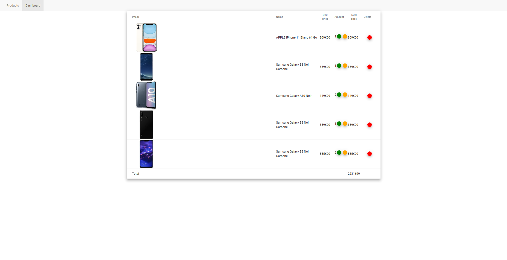
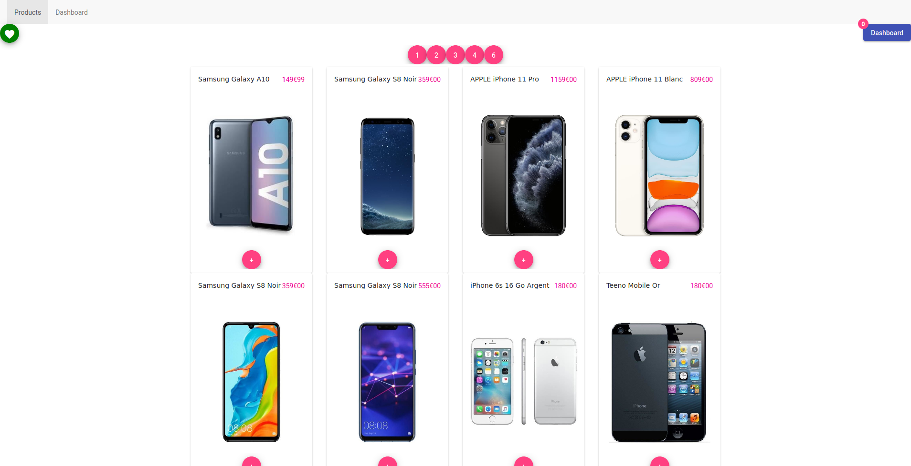

# SHOPPING PHONE APPLICATION

# DEMO

# Backend

    docker build -t nest-app .
    # start
    docker-compose up
    # end
    docker-compose down 
 
# Frontend 
## All Products home without connexion

## Information by product with id

## Authentication when you want to validate the dashboard 

## Dashboard or basket

## All Products home with connexion

# Dev
In order to fill the base at the beginning I use a shell script

	./script